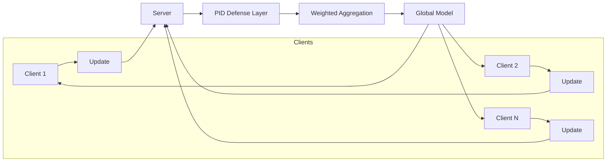

# Empirical Robustness Evaluation of Federated Learning under Poisoning Attacks

This repository presents an empirical analysis of robustness and failure modes in federated learning under poisoning attacks. Federated learning is treated as the experimental environment, poisoning attacks as adversarial stressors, and the PID (Proportional–Integral–Derivative) mechanism is evaluated as a case-study anomaly-detection defense at the server.

The focus is on understanding system behavior and limitations under realistic assumptions, not on proposing new algorithms or achieving state-of-the-art accuracy.

---

## Overview

Federated learning enables distributed model training without sharing raw client data, but it remains vulnerable to malicious clients that submit poisoned updates. This project studies that vulnerability through a controlled setup including:

- A baseline federated learning system trained on FEMNIST
- A representative poisoning attack
- A PID-based anomaly-detection defense at the server

The goal is to analyze training dynamics, defense behavior, and failure cases rather than optimize performance.

---

## What This Project Demonstrates

- How poisoning attacks affect federated learning dynamics over rounds  
- When anomaly-detection defenses help and when they fail  
- Sensitivity to non-IID data and early-round instability  
- The tradeoffs introduced by server-side filtering mechanisms  

---

## Threat Model

- **Adversary:** A subset of clients submits poisoned model updates.
- **Server:** Aggregates updates and may apply PID-based anomaly detection.
- **Visibility:** The server observes only model updates, not client data.

**Assumptions:**
- Attacks are fixed and non-adaptive.
- Defenses operate solely on update statistics.
- Clients otherwise follow the FL protocol.

---

## Federated Learning Flow (with PID Defense)



---

## Implemented Scenarios

- **Baseline**  
  Standard federated learning with all clients behaving honestly.

- **Poisoning Attack**  
  A fixed subset of clients submits poisoned updates; no defense is applied.

- **PID Defense**  
  The poisoning attack is present, and the server applies PID-based anomaly detection during aggregation.

---

## Running Experiments

Install dependencies:

```bash
pip install -r requirements.txt
```

### Run a baseline experiment

```bash
PYTHONPATH=. python experiments/baseline_fl.py \
  --clients 10 --rounds 5 \
  --out experiments/results/baseline.csv
```

Attack and defense modes are enabled via flags in the same script.  
Use `--help` on experiment scripts for available options.

### Generate plots

```bash
PYTHONPATH=. python experiments/plot_metrics.py \
  --in experiments/results/baseline.csv \
  --out experiments/plots/
```

## Outputs

- **Results:** Per-round CSV logs written to `experiments/results/`
- **Plots:** Accuracy, loss, and defense-behavior visualizations written to `experiments/plots/`
